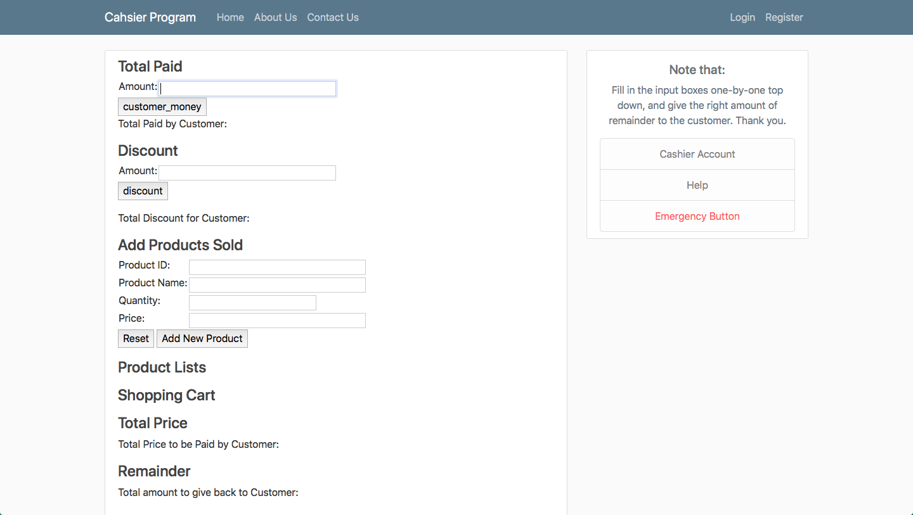

Web Programming Project 2  
Amira Salsabila Hidayat  
16/395993/PA/17334

Features:
- Add a list of Sold Products
- Input Cash Paid by Customer
- Add and Substract a list of Products to Customer's Shopping Cart
- Count Customer's Total
- Count Customer's Remainder

Documentation:
- Home 

- Add Total Paid by Customer

- Add Discount to Customer

- Add a list of products that the Store sells

- Add products to the Customer's Shopping Cart, the total amount that should be paid and the remainder that should be given will automatically be calculated and shown

- An example when less quantity of product is subtracted

- An example when more quantity of product is added

- An example when more types of products are added

